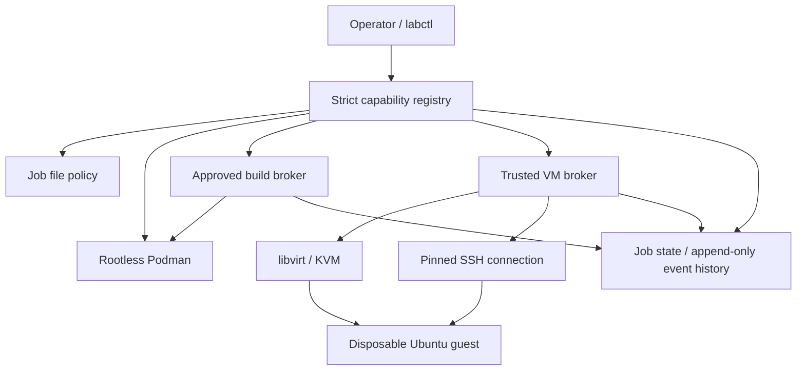

# Architecture and trust boundaries

The operator installs reviewed broker code. The controller is trusted infrastructure
with access to libvirt. It accepts a finite set of capabilities with Pydantic schemas;
there is no arbitrary shell, arbitrary image URL, host-path, SSH destination, or VM XML
capability. Internal subprocesses use argument arrays and a bounded output/deadline runner.

The rootless sandbox receives only its workspace at `/job` and its harmless protected
fixture at `/reference`. Broker state, events, build manifests, private keys, and other
jobs are outside these mounts. The root filesystem is read-only. The sandbox has no
network, no Linux capabilities, no-new-privileges, a private cgroup namespace, a 512 MiB
memory limit, one CPU of quota, 128 PIDs, and a 256 MiB noexec/nosuid/nodev tmpfs.
The validation reads the active kernel limits and verifies mount/network behavior.

| Capability | Workspace | Host | libvirt | Network |
|---|---|---|---|---|
| File read/list/find | One registered job | Descriptor-confined reads | None | None |
| Git inspection | Registered source in sandbox | None | None | None |
| Patch check/apply | Registered toy patch in sandbox | None | None | None |
| Build | Fixed compile/pytest/wheel profile | Imports a bounded artifact into trusted storage | None | None |
| Image preparation | None | Lab image cache | None | Official HTTPS image endpoint only |
| VM deploy/status/destroy | No caller paths | Broker-managed disk directory | Trusted broker | Default NAT/DHCP |
| Guest tests | Current verified artifact | Lab-only keys | Ownership/IP resolution | Pinned SSH to that VM |

## Evidence and stale state

Each job has a source ID, selected patch ID, build ID, artifact ID, image ID, VM ID,
test ID, `state.json`, and `events.jsonl`. Mutating operations hold a per-job file lock;
VM quota checks and creation/destruction hold a global VM lock. State files are replaced
atomically. Events are fsynced. Runtime directories are private to the controller account.

A build hashes all accepted source files, including untracked files, before and after
execution. The build runs on a temporary source copy and produces a real wheel. The broker
copies the bounded regular output into trusted storage and hashes it. The selected patch
must have been applied to the current source. Selecting another patch immediately resets
the current build to `NOT_RUN`; old records remain historical.

An **image ID is a deployment manifest**, binding the official base image digest to one
job, successful build, and wheel digest. The wheel is delivered over SSH and verified
inside the guest; it is not baked into the base qcow2. Cloud-init writes this manifest
binding into the guest. The smoke suite checks the marker and wheel hash before importing
and testing the toy function. Source edits, artifact corruption, and mismatched VM/image
requests invalidate or reject the old evidence.

## VM ownership and lifecycle

VMs have random IDs, a recorded UUID, a generated MAC, and an XML metadata marker containing
the installation, job, VM, and image IDs. Names alone never authorize operations. Cleanup
first verifies the UUID and metadata, stops/undefines the owned domain, confirms absence,
and then deletes only its matching disk directory. A hypervisor connection error is an
error, not evidence that a VM is absent. Failed deployment records allow later cleanup.

The broker uses `qemu:///system`, `virt-install --print-xml`, explicit KVM mode, the host's
available Ubuntu osinfo profile, and libvirt's default NAT/DHCP network. Guest IPs must
match the VM MAC and the configured network. SSH client and host keys are generated per
VM. The expected guest host public key is pinned before the first connection. User SSH
configuration, agent keys, and permissive host-key checking are not used.

The broker limits the installation to three outstanding VMs with a fixed one-vCPU,
1536 MiB, 12 GiB virtual disk profile. A non-root systemd service reaps expired or failed
VMs; guests also schedule shutdown after cloud-init. The controller removes private key
files and user-data during cleanup. The base image is preserved and checked before reuse.

## Limits of this proof

This is a single trusted operator/broker with untrusted job code, not a multi-tenant
host security boundary. The owner of the lab account can alter its own broker files/state.
The libvirt group is powerful; do not hand that account to an untrusted caller or expose
this local CLI as an unauthenticated network service. Rootless containers still share the
host kernel. Guest NAT permits outbound network access. Workspace disk usage is limited
by available host storage; the lab does not claim a per-job filesystem quota.

The protected fixture's read-only guarantee is enforced by the mount, not by a promise
in a prompt. Host file tools reject traversal, symlink components, hardlinks, special
files, and oversized files. Git/patch/project code executes inside the container.
The initial patch catalog intentionally contains only generic fixtures; arbitrary patch
upload and custom build/VM profiles require reviewed extensions to the registry.

Fault switches return explicit controlled failures and are marked as simulations. They
do not prove physical disk exhaustion or a real network outage. Real build failure,
container execution timeout, sandbox denial, artifact hashing, VM boot, SSH, guest tests,
and cleanup have separate checks.

Implementation references: [Ubuntu libvirt](https://documentation.ubuntu.com/server/how-to/virtualisation/libvirt/),
[Podman run](https://docs.podman.io/en/latest/markdown/podman-run.1.html),
[virsh](https://www.libvirt.org/manpages/virsh.html),
[virt-install](https://manpages.ubuntu.com/manpages/noble/man1/virt-install.1.html),
[Ubuntu cloud images](https://cloud-images.ubuntu.com/noble/current/), and
[cloud-init modules](https://docs.cloud-init.io/en/latest/reference/modules.html).
